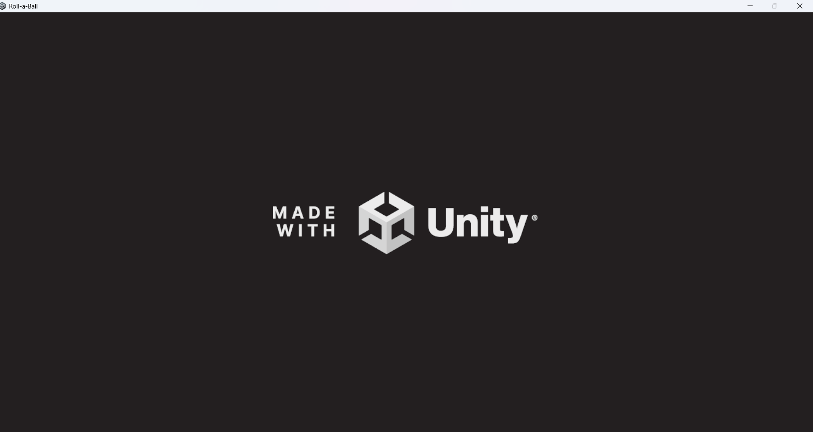
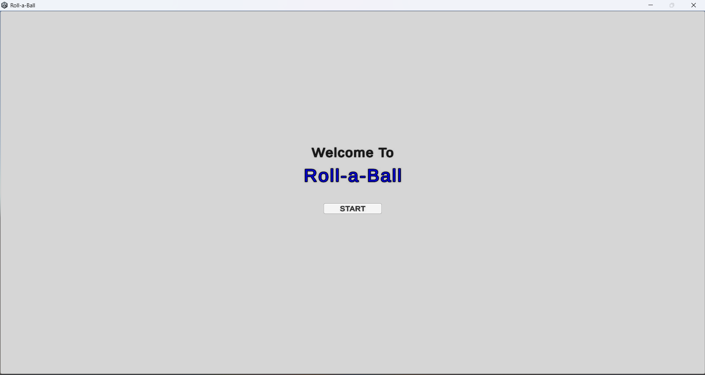
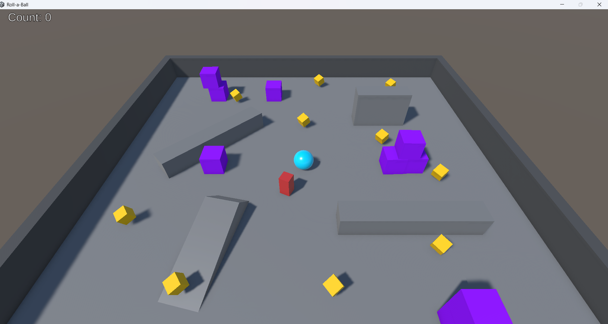
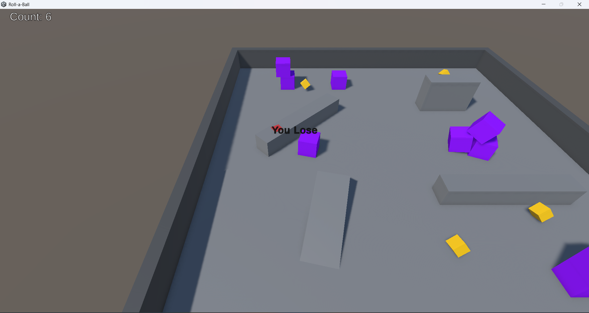
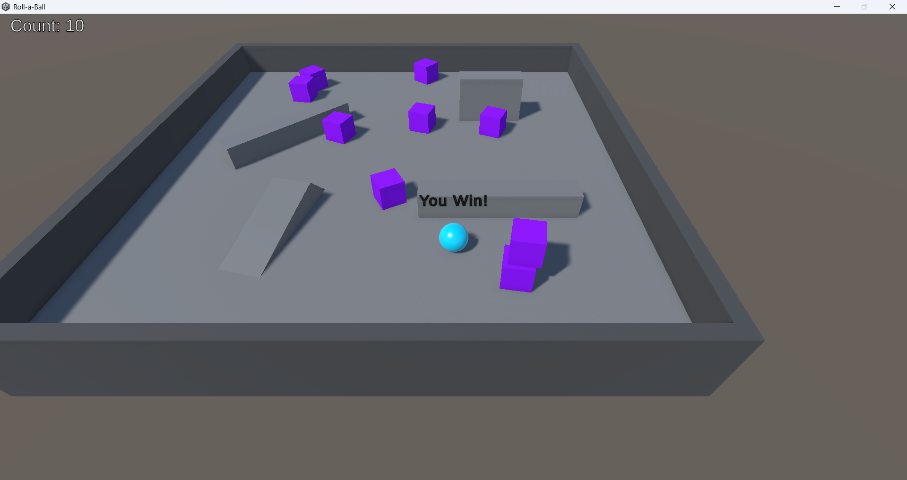

\# Roll-a-Ball 🎮

A beginner-friendly Unity 3D game where the player controls a ball and collects all pickup objects while avoiding obstacles.

This game was created while learning Unity and C# as part of my game development journey.

---

\## 🕹️ Gameplay

\- Control a rolling ball

\- Collect all items on the ground

\- Avoid obstacles

\- Win when all items are collected

---
## 📸 Screenshots

\## 🎮 Controls

\- W / A / S / D or Arrow Keys — Move the ball

\- Mouse — Navigate UI

---

\## 🛠 Built With

\- Unity

\- C#

\- Visual Studio

\- Git \& GitHub

---

\## 📦 How to Run

1\. Download the game from the Releases section.

2\. Extract the zip file.

3\. Run `Roll-a-Ball.exe`.

---

\## 👤 Developer

\*\*Preet Deshbhratar\*\*  

GitHub: https://github.com/IdleAgent

